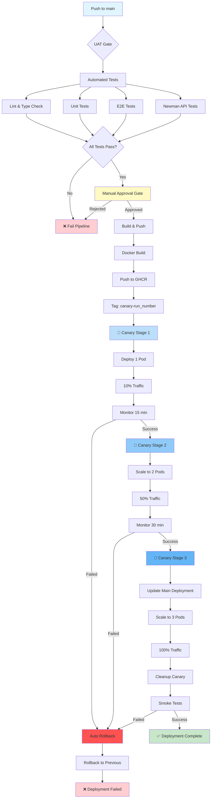

# Canary Deployment Flow Visualization

## Complete Pipeline Flow



## Stage-by-Stage Visual

### Stage 1: UAT Gate
```
┌─────────────────────────────────────────────────────────┐
│                      UAT GATE                            │
├─────────────────────────────────────────────────────────┤
│                                                          │
│  ┌──────────┐  ┌──────────┐  ┌──────────┐             │
│  │   Lint   │  │  Types   │  │   Unit   │             │
│  │  Check   │  │  Check   │  │  Tests   │             │
│  └─────┬────┘  └─────┬────┘  └─────┬────┘             │
│        │             │             │                    │
│        └─────────────┼─────────────┘                    │
│                      ↓                                   │
│              ┌───────────────┐                          │
│              │   E2E Tests   │                          │
│              │   (Playwright)│                          │
│              └───────┬───────┘                          │
│                      ↓                                   │
│              ┌───────────────┐                          │
│              │  Newman API   │                          │
│              │     Tests     │                          │
│              └───────┬───────┘                          │
│                      ↓                                   │
│              ┌───────────────┐                          │
│              │    Manual     │                          │
│              │   Approval    │  ← Human Review          │
│              └───────────────┘                          │
│                                                          │
└─────────────────────────────────────────────────────────┘
```

### Stage 2: Canary Deployment - 10% Traffic
```
Production Environment

Before:
┌─────────────────────────────────────────────────────────┐
│  Stable Version (Current)                                │
│  ████████████████████████████████████████████  100%     │
│  Pods: [P1] [P2] [P3]                                   │
└─────────────────────────────────────────────────────────┘

After Stage 1:
┌─────────────────────────────────────────────────────────┐
│  Canary (New)                                            │
│  ████  10% ← [C1] Canary Pod                            │
│                                                          │
│  Stable (Current)                                        │
│  ████████████████████████████████████  90%              │
│  Pods: [P1] [P2] [P3]                                   │
└─────────────────────────────────────────────────────────┘

Monitoring: 15 minutes
- Health checks every 60s
- Error rate < 1%
- Response time < 500ms
- No pod restarts
```

### Stage 3: Canary Deployment - 50% Traffic
```
After Stage 2:
┌─────────────────────────────────────────────────────────┐
│  Canary (New)                                            │
│  ████████████████████  50%                              │
│  Pods: [C1] [C2]                                        │
│                                                          │
│  Stable (Current)                                        │
│  ████████████████████  50%                              │
│  Pods: [P1] [P2] [P3]                                   │
└─────────────────────────────────────────────────────────┘

Monitoring: 30 minutes
- Health checks every 60s
- Comparative metrics
- Error rate monitoring
- Performance validation
```

### Stage 4: Full Production - 100% Traffic
```
After Stage 3:
┌─────────────────────────────────────────────────────────┐
│  Production (New Version)                                │
│  ████████████████████████████████████████████  100%     │
│  Pods: [N1] [N2] [N3]                                   │
│                                                          │
│  Canary Resources: CLEANED UP                           │
│  Previous Version: ROLLED BACK                          │
└─────────────────────────────────────────────────────────┘

Final Validation:
✓ Smoke tests passed
✓ All pods healthy
✓ Metrics nominal
✓ No errors detected
```

## Traffic Split Mechanism

```
                          ┌─────────────────┐
                          │   Traefik       │
                          │   Ingress       │
                          └────────┬────────┘
                                   │
                    ┌──────────────┴──────────────┐
                    │   TraefikService (Weighted) │
                    └──────────────┬──────────────┘
                                   │
                ┌──────────────────┴──────────────────┐
                │                                      │
         Weight: 90%                            Weight: 10%
                │                                      │
        ┌───────▼────────┐                    ┌───────▼────────┐
        │  Service:      │                    │  Service:      │
        │  psra-new      │                    │  psra-new-     │
        │                │                    │  canary        │
        └───────┬────────┘                    └───────┬────────┘
                │                                      │
    ┌───────────┼───────────┐                         │
    │           │           │                         │
┌───▼───┐   ┌───▼───┐   ┌───▼───┐              ┌────▼────┐
│  P1   │   │  P2   │   │  P3   │              │   C1    │
│ Pod   │   │ Pod   │   │ Pod   │              │  Pod    │
│Stable │   │Stable │   │Stable │              │ Canary  │
└───────┘   └───────┘   └───────┘              └─────────┘
```

## Rollback Flow

```
                    ┌────────────────┐
                    │  Failure       │
                    │  Detected      │
                    └────────┬───────┘
                             │
              ┌──────────────┴──────────────┐
              │                             │
        ┌─────▼──────┐              ┌──────▼─────┐
        │ Health     │              │ Manual     │
        │ Check      │              │ Trigger    │
        │ Failed     │              │            │
        └─────┬──────┘              └──────┬─────┘
              │                             │
              └──────────────┬──────────────┘
                             │
                    ┌────────▼───────┐
                    │  Emergency     │
                    │  Rollback Job  │
                    └────────┬───────┘
                             │
              ┌──────────────┴──────────────┐
              │                             │
        ┌─────▼──────┐              ┌──────▼─────┐
        │ Rollback   │              │ Delete     │
        │ Main       │              │ Canary     │
        │ Deployment │              │ Resources  │
        └─────┬──────┘              └──────┬─────┘
              │                             │
              └──────────────┬──────────────┘
                             │
                    ┌────────▼───────┐
                    │  Verify        │
                    │  Rollback      │
                    │  Success       │
                    └────────┬───────┘
                             │
                    ┌────────▼───────┐
                    │  Send Slack    │
                    │  Alert         │
                    └────────────────┘
```

## Timeline Visualization

```
Total Duration: ~60-70 minutes

┌───────┬─────────────────────────────────────────────────────────────────────┐
│ Min 0 │ Push to main / Trigger workflow                                     │
├───────┼─────────────────────────────────────────────────────────────────────┤
│ Min 1 │ ┌─────────────────────────────────────────┐                         │
│       │ │        UAT Automated Tests              │                         │
│ Min 5 │ │ • Lint, Type Check, Unit, E2E, API     │                         │
│       │ └─────────────────────────────────────────┘                         │
├───────┼─────────────────────────────────────────────────────────────────────┤
│       │ ┌─────────────────────────────────────────┐                         │
│ Min 5 │ │        Manual Approval Gate             │                         │
│   -   │ │ • Human review required                 │ ← Variable Duration     │
│ Min ? │ │ • Check UAT results                     │                         │
│       │ └─────────────────────────────────────────┘                         │
├───────┼─────────────────────────────────────────────────────────────────────┤
│       │ ┌─────────────────────────────────────────┐                         │
│ Min ? │ │        Build & Push                     │                         │
│   +   │ │ • Docker build with caching             │                         │
│ Min 5 │ │ • Push to GHCR                          │                         │
│       │ └─────────────────────────────────────────┘                         │
├───────┼─────────────────────────────────────────────────────────────────────┤
│       │ ┌─────────────────────────────────────────┐                         │
│       │ │   🚀 Canary Stage 1 (10% Traffic)       │                         │
│  +15  │ │ • Deploy 1 canary pod                   │                         │
│ Min   │ │ • Health checks + monitoring            │                         │
│       │ └─────────────────────────────────────────┘                         │
├───────┼─────────────────────────────────────────────────────────────────────┤
│       │ ┌─────────────────────────────────────────┐                         │
│       │ │   🚀 Canary Stage 2 (50% Traffic)       │                         │
│  +30  │ │ • Scale to 2 canary pods                │                         │
│ Min   │ │ • Extended monitoring                   │                         │
│       │ └─────────────────────────────────────────┘                         │
├───────┼─────────────────────────────────────────────────────────────────────┤
│       │ ┌─────────────────────────────────────────┐                         │
│       │ │   🚀 Canary Stage 3 (100% Traffic)      │                         │
│  +5   │ │ • Update main deployment                │                         │
│ Min   │ │ • Cleanup canary resources              │                         │
│       │ └─────────────────────────────────────────┘                         │
├───────┼─────────────────────────────────────────────────────────────────────┤
│       │ ┌─────────────────────────────────────────┐                         │
│  +2   │ │        Smoke Tests                      │                         │
│ Min   │ │ • Final health checks                   │                         │
│       │ └─────────────────────────────────────────┘                         │
├───────┼─────────────────────────────────────────────────────────────────────┤
│~60-70 │ ✅ Deployment Complete                                              │
│ Min   │                                                                      │
└───────┴─────────────────────────────────────────────────────────────────────┘
```

## Health Check Flow

```
Every 60 seconds during canary stages:

┌─────────────────────────────────────────┐
│  kubectl get pods -l version=canary     │
└────────────────┬────────────────────────┘
                 │
                 ▼
        ┌────────────────┐
        │  Check Status  │
        │  Running?      │
        └────────┬───────┘
                 │
        ┌────────┴────────┐
        │                 │
    ┌───▼───┐      ┌──────▼─────┐
    │  Yes  │      │    No      │
    └───┬───┘      └──────┬─────┘
        │                 │
        ▼                 ▼
┌───────────────┐  ┌──────────────┐
│ curl /health  │  │   ROLLBACK   │
└───────┬───────┘  └──────────────┘
        │
        ▼
┌───────────────┐
│ Check Restart │
│    Count      │
└───────┬───────┘
        │
        ▼
┌───────────────┐
│   > 0 ?       │
└───────┬───────┘
        │
    ┌───┴────┐
    │        │
┌───▼──┐  ┌──▼────┐
│  No  │  │  Yes  │
└───┬──┘  └───┬───┘
    │         │
    ▼         ▼
┌─────┐  ┌──────────┐
│ OK  │  │ ROLLBACK │
└─────┘  └──────────┘
```

## Slack Notification Timeline

```
Time    Event                               Notification
─────────────────────────────────────────────────────────────
t=0     Push to main                        (None)
t=1     UAT tests started                   (None)
t=5     UAT tests complete                  ✅ UAT Tests Passed
t=5     Awaiting approval                   ⚠️  Approval Required
t=?     Approved                            (None)
t=?+3   Build complete                      ✅ Build Complete
t=?+3   Stage 1 started                     (None)
t=?+18  Stage 1 complete                    ✅ Stage 1 (10%) Complete
t=?+18  Stage 2 started                     (None)
t=?+48  Stage 2 complete                    ✅ Stage 2 (50%) Complete
t=?+48  Stage 3 started                     (None)
t=?+53  Stage 3 complete                    ✅ Stage 3 (100%) Complete
t=?+55  Smoke tests complete                ✅ Smoke Tests Passed
t=?+55  Deployment complete                 🚀 Deployment Complete

Failure at any stage:                       🚨 Emergency Rollback
```

## Decision Tree

```
                    ┌─────────────┐
                    │   Deploy    │
                    └──────┬──────┘
                           │
                    ┌──────▼──────┐
                    │  UAT Tests  │
                    │   Pass?     │
                    └──────┬──────┘
                           │
              ┌────────────┴────────────┐
              │                         │
         ┌────▼────┐              ┌─────▼─────┐
         │   Yes   │              │    No     │
         └────┬────┘              └─────┬─────┘
              │                         │
    ┌─────────▼─────────┐          ┌────▼────┐
    │ Manual Approval?  │          │  STOP   │
    └─────────┬─────────┘          └─────────┘
              │
    ┌─────────┴─────────┐
    │                   │
┌───▼────┐      ┌───────▼────┐
│Approved│      │  Rejected  │
└───┬────┘      └───────┬────┘
    │                   │
    │              ┌────▼────┐
    │              │  STOP   │
    │              └─────────┘
    │
┌───▼────────┐
│Build Image │
└───┬────────┘
    │
┌───▼─────────┐
│ Stage 1 10% │
│   Healthy?  │
└───┬─────────┘
    │
┌───┴─────┐
│         │
▼         ▼
Yes     No → ROLLBACK
│
┌───▼─────────┐
│ Stage 2 50% │
│   Healthy?  │
└───┬─────────┘
    │
┌───┴─────┐
│         │
▼         ▼
Yes     No → ROLLBACK
│
┌───▼──────────┐
│ Stage 3 100% │
│   Healthy?   │
└───┬──────────┘
    │
┌───┴─────┐
│         │
▼         ▼
Yes     No → ROLLBACK
│
┌───▼────────┐
│Smoke Tests │
│    Pass?   │
└───┬────────┘
    │
┌───┴─────┐
│         │
▼         ▼
Yes     No → ROLLBACK
│
┌───▼────┐
│SUCCESS │
└────────┘
```

## Pod Lifecycle During Deployment

```
Time: t=0 (Before Deployment)
┌─────────────────────────────────────┐
│ Stable Deployment                   │
│ ┌────┐  ┌────┐  ┌────┐             │
│ │ P1 │  │ P2 │  │ P3 │  Running    │
│ └────┘  └────┘  └────┘             │
└─────────────────────────────────────┘

Time: t=1 (Stage 1 - 10%)
┌─────────────────────────────────────┐
│ Stable Deployment                   │
│ ┌────┐  ┌────┐  ┌────┐             │
│ │ P1 │  │ P2 │  │ P3 │  Running    │
│ └────┘  └────┘  └────┘             │
│                                     │
│ Canary Deployment                   │
│ ┌────┐                              │
│ │ C1 │  Starting → Running          │
│ └────┘                              │
└─────────────────────────────────────┘

Time: t=2 (Stage 2 - 50%)
┌─────────────────────────────────────┐
│ Stable Deployment                   │
│ ┌────┐  ┌────┐  ┌────┐             │
│ │ P1 │  │ P2 │  │ P3 │  Running    │
│ └────┘  └────┘  └────┘             │
│                                     │
│ Canary Deployment                   │
│ ┌────┐  ┌────┐                     │
│ │ C1 │  │ C2 │  Running            │
│ └────┘  └────┘                     │
└─────────────────────────────────────┘

Time: t=3 (Stage 3 - 100%)
┌─────────────────────────────────────┐
│ Production Deployment               │
│ ┌────┐  ┌────┐  ┌────┐             │
│ │ N1 │  │ N2 │  │ N3 │  Running    │
│ └────┘  └────┘  └────┘             │
│                                     │
│ Old Pods: Terminating               │
│ ┌────┐  ┌────┐  ┌────┐             │
│ │ P1 │  │ P2 │  │ P3 │  →Stopped   │
│ └────┘  └────┘  └────┘             │
│                                     │
│ Canary: Cleaning Up                 │
│ ┌────┐  ┌────┐                     │
│ │ C1 │  │ C2 │  →Stopped           │
│ └────┘  └────┘                     │
└─────────────────────────────────────┘

Time: t=4 (After Cleanup)
┌─────────────────────────────────────┐
│ Production Deployment               │
│ ┌────┐  ┌────┐  ┌────┐             │
│ │ N1 │  │ N2 │  │ N3 │  Running    │
│ └────┘  └────┘  └────┘             │
└─────────────────────────────────────┘
```

---

**Note**: All diagrams are conceptual representations. Actual implementation may vary based on cluster configuration and load conditions.
