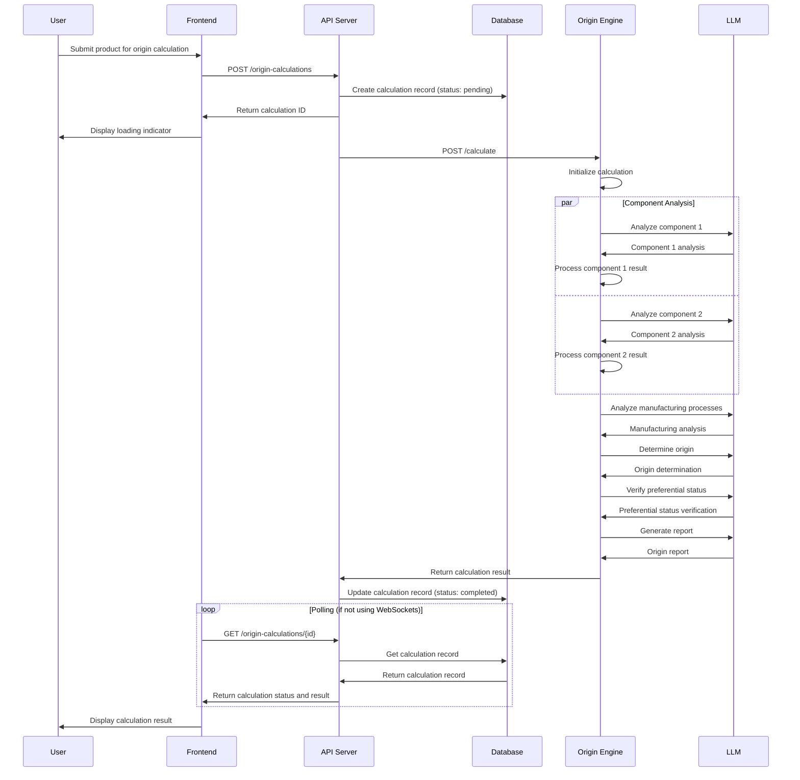
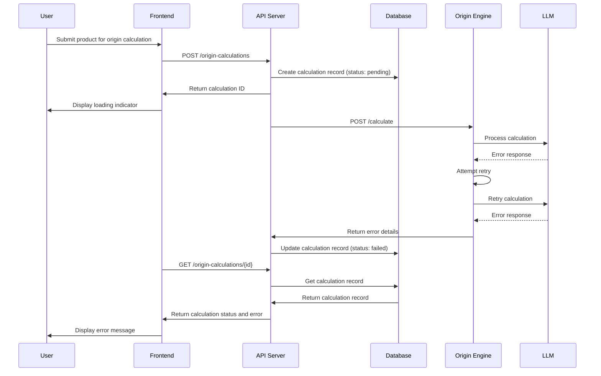
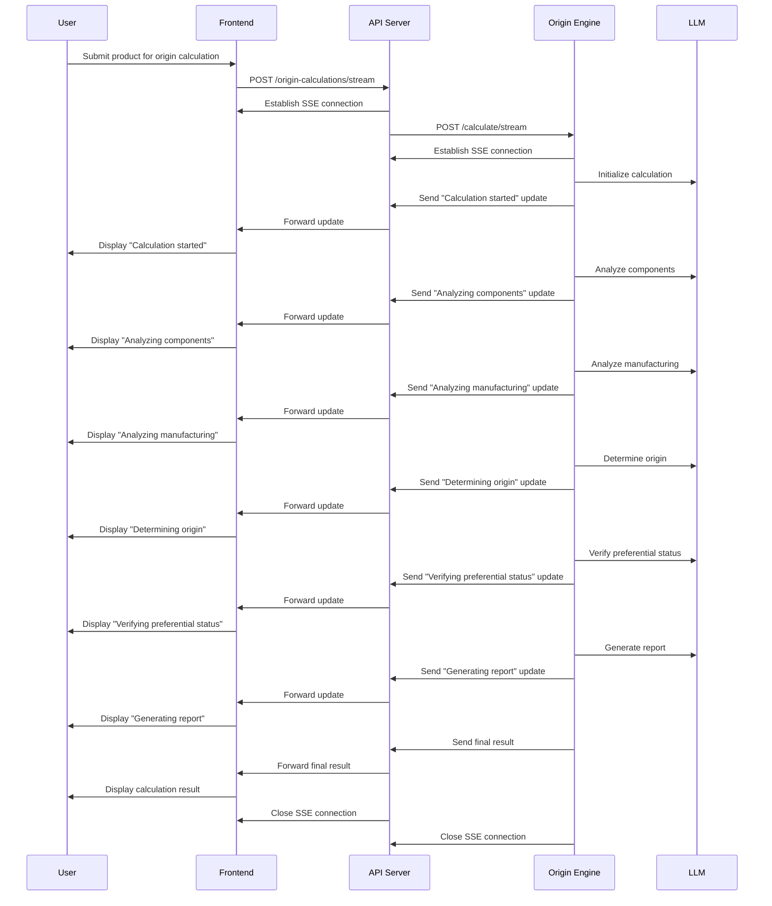

# Origin Calculation Sequence Diagram

This document provides a detailed sequence diagram for the origin calculation flow in the PSRA-LTSD Enterprise v2 platform.

## Sequence Diagram

## Detailed Flow Description

### 1. Calculation Initiation

1. **User Submits Product**:
   - User fills out product details and selects trade agreement
   - User clicks "Calculate Origin" button

2. **Frontend Sends Request**:
   - Frontend validates form data
   - Frontend sends POST request to `/origin-calculations`
   - Request includes product ID, trade agreement ID, and calculation type

3. **API Server Creates Record**:
   - API Server validates request data
   - API Server creates calculation record in database with status "pending"
   - API Server returns calculation ID to Frontend

4. **Frontend Updates UI**:
   - Frontend displays loading indicator
   - Frontend starts polling for updates or establishes WebSocket connection

### 2. Origin Engine Processing

1. **API Server Forwards Request**:
   - API Server retrieves product and trade agreement details
   - API Server sends calculation request to Origin Engine

2. **Origin Engine Initializes**:
   - Origin Engine validates input data
   - Origin Engine creates calculation context
   - Origin Engine initializes LangGraph workflow

3. **Parallel Component Analysis**:
   - Origin Engine processes components in parallel
   - For each component:
     - Send component data to LLM
     - LLM analyzes component origin
     - Process and store component analysis

4. **Manufacturing Analysis**:
   - Origin Engine sends manufacturing process data to LLM
   - LLM analyzes impact on origin
   - Origin Engine processes manufacturing analysis

5. **Origin Determination**:
   - Origin Engine sends component and manufacturing analyses to LLM
   - LLM determines product origin
   - Origin Engine processes origin determination

6. **Preferential Status Verification**:
   - Origin Engine sends origin and trade agreement data to LLM
   - LLM verifies preferential status
   - Origin Engine processes preferential status verification

7. **Report Generation**:
   - Origin Engine sends all analyses to LLM
   - LLM generates comprehensive origin report
   - Origin Engine processes and formats report

### 3. Result Handling

1. **Origin Engine Returns Result**:
   - Origin Engine compiles final result
   - Origin Engine returns result to API Server

2. **API Server Updates Record**:
   - API Server validates result
   - API Server updates calculation record in database with status "completed"
   - API Server stores result data

3. **Frontend Retrieves Result**:
   - If polling: Frontend periodically checks calculation status
   - If WebSocket: API Server pushes update to Frontend
   - Frontend receives completed calculation with result

4. **Frontend Displays Result**:
   - Frontend processes result data
   - Frontend displays origin determination and report
   - Frontend provides options to download or share report

## Alternative Flows

### Error Flow

### Streaming Flow

## Performance Considerations

1. **Parallel Processing**:
   - Component analysis is performed in parallel to reduce calculation time
   - Multiple calculations can be processed simultaneously by scaling the Origin Engine

2. **Caching**:
   - Similar calculations are cached to avoid redundant processing
   - Trade agreement rules are cached for quick access

3. **Asynchronous Processing**:
   - Long-running calculations are processed asynchronously
   - Users can continue working while calculations are in progress

4. **Streaming Updates**:
   - Real-time updates provide feedback during long-running calculations
   - Users can see the progress of their calculations

## Security Considerations

1. **Authentication and Authorization**:
   - All requests require authentication
   - Users can only access their own calculations
   - API keys are used for service-to-service communication

2. **Data Protection**:
   - Sensitive product data is encrypted
   - Calculation results are stored securely
   - Access to calculation data is logged

3. **Rate Limiting**:
   - API endpoints are rate limited to prevent abuse
   - LLM requests are rate limited to control costs

## Conclusion

The origin calculation flow is designed to provide a seamless user experience while ensuring high performance, reliability, and security. The asynchronous and streaming options allow for efficient processing of complex calculations, while the parallel processing and caching strategies optimize performance.
