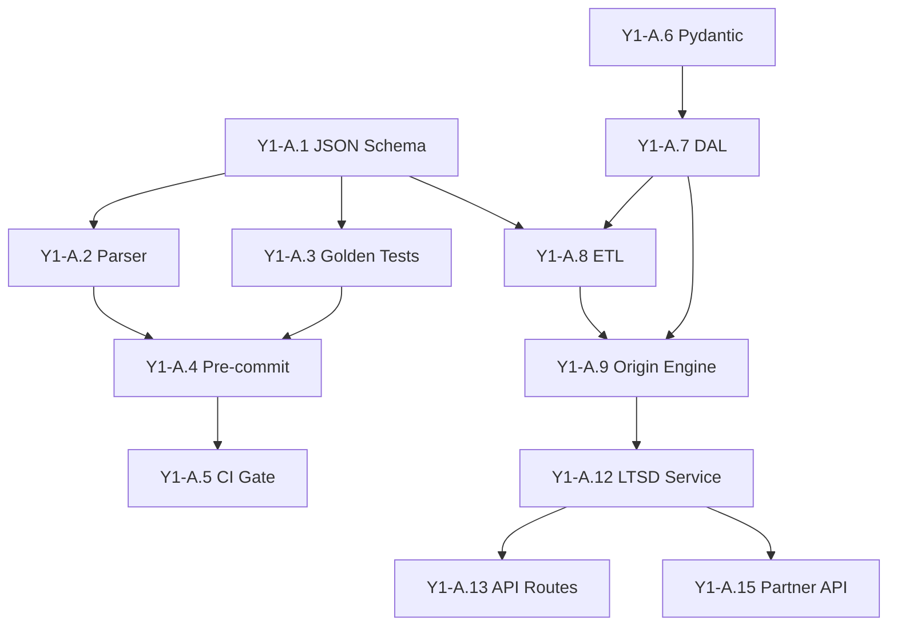
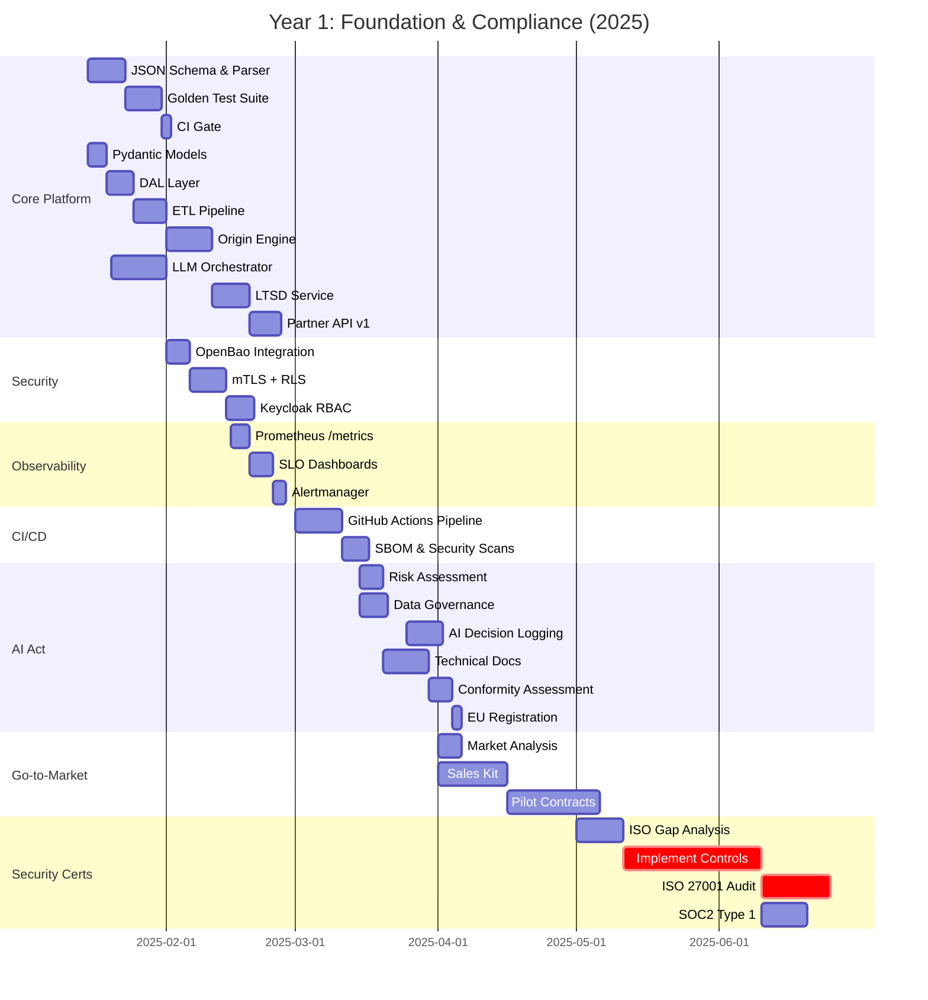
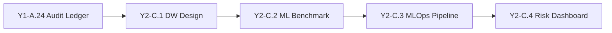
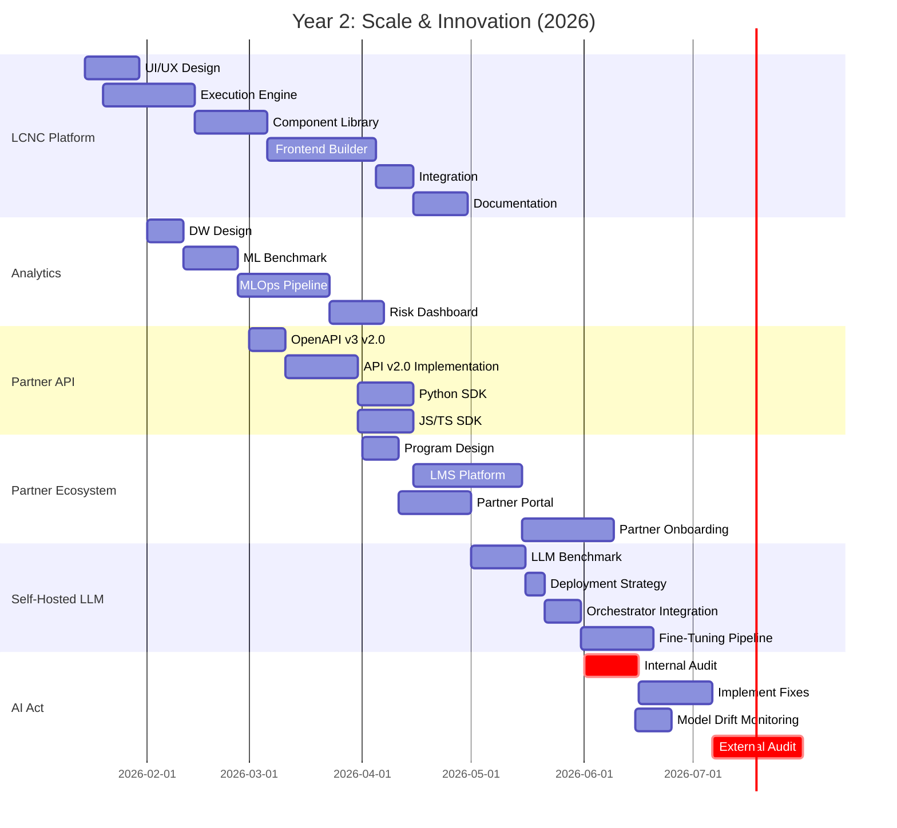
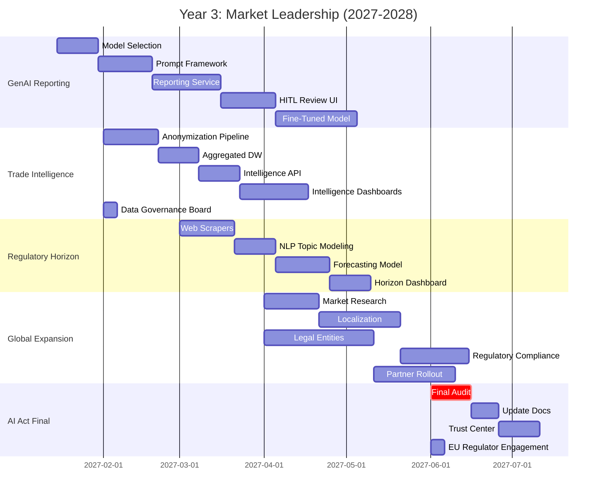
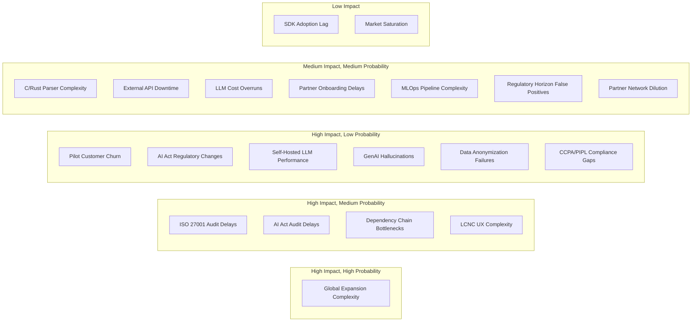
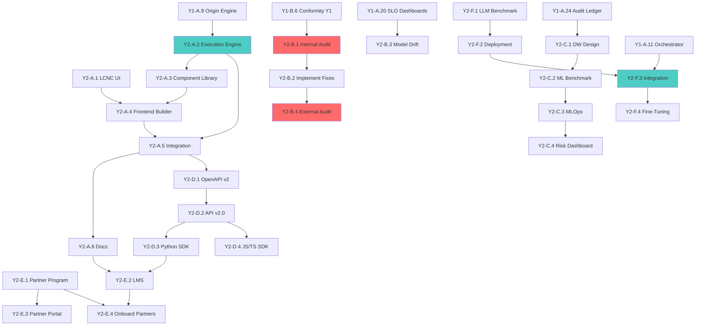
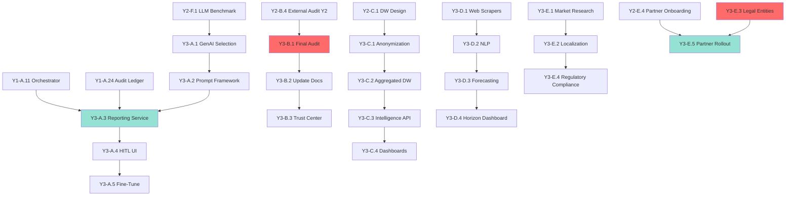

# Sevensa PSRA-LTSD Enterprise Roadmap 2025-2028

**Version:** 1.0
**Last Updated:** October 13, 2025
**Status:** Active Development

---

## Executive Summary

This roadmap outlines the strategic development plan for the Sevensa PSRA-LTSD (Preferential Status of Rules of Origin & Long-Term Supplier Declaration) platform over a three-year horizon (2025-2028). The platform is designed to revolutionize customs compliance automation using AI-powered rules-as-code, multi-LLM orchestration, and enterprise-grade infrastructure.

### Key Metrics

| Metric | Value |
|--------|-------|
| **Total Tasks** | 125 |
| **Total Effort** | 1,264 person-days (~5.7 person-years) |
| **Year 1 Tasks** | 49 tasks (369 days) |
| **Year 2 Tasks** | 26 tasks (445 days) |
| **Year 3 Tasks** | 23 tasks (450 days) |
| **High-Impact Tasks** | 48 (38.4%) |
| **Tasks with Dependencies** | 74 (59.2%) |

---

## Table of Contents

1. [Strategic Vision](#strategic-vision)
2. [Year 1: Foundation & Compliance (2025)](#year-1-foundation--compliance-2025)
3. [Year 2: Scale & Innovation (2026)](#year-2-scale--innovation-2026)
4. [Year 3: Market Leadership (2027-2028)](#year-3-market-leadership-2027-2028)
5. [Timeline & Gantt Chart](#timeline--gantt-chart)
6. [Critical Path Analysis](#critical-path-analysis)
7. [Risk Assessment](#risk-assessment)
8. [Milestones & Deliverables](#milestones--deliverables)
9. [Resource Planning](#resource-planning)
10. [Success Metrics](#success-metrics)

---

## Strategic Vision

### Mission
To become the leading AI-powered customs compliance platform in Europe, enabling enterprises to automate preferential origin rules and supplier declarations with unprecedented accuracy, transparency, and regulatory compliance.

### Core Principles
1. **Rules-as-Code**: All customs regulations modeled as deterministic, version-controlled JSON schemas
2. **AI-First**: Multi-LLM orchestration with cost-aware routing and consensus mechanisms
3. **Compliance-by-Design**: Built-in EU AI Act, GDPR, ISO 27001, and SOC2 compliance
4. **API-First**: Extensible Partner API ecosystem for ERP/TMS integration
5. **Observable**: Comprehensive SLO-based monitoring and audit trails

---

## Year 1: Foundation & Compliance (2025)

**Theme:** Build the core platform, achieve regulatory compliance, and onboard first pilot customers.

### Phase Y1-A: PSRA Core Platform (172 days, 27 tasks)

**Objective:** Develop the deterministic rules engine, ETL pipelines, connectors, and LTSD microservices.

#### Key Deliverables
- **JSON Schema for Rules-as-Code**: Strict validation schema (psr_rule.schema.v2.json)
- **Deterministic Origin Engine**: Process BOM, rule parameters, and context
- **Multi-LLM Orchestrator**: Cost-aware routing, caching, and consensus
- **External Connectors**: HMRC, TARIC, WCO APIs with Redis caching
- **LTSD Microservice**: Document evaluation and PDF generation
- **Partner API v1.0**: Webhooks for state changes

#### Critical Tasks (High Priority)
```
Y1-A.1  → Define JSON Schema for Rules-as-Code (3 days)
Y1-A.2  → C/Rust parser + validator (5 days) [Depends: Y1-A.1]
Y1-A.3  → Golden test suite (50+ cases) (8 days)
Y1-A.6  → Pydantic domain models (4 days)
Y1-A.7  → SQLAlchemy 2.0 DAL (6 days) [Depends: Y1-A.6]
Y1-A.8  → ETL pipeline + Great Expectations (7 days) [Depends: Y1-A.1, Y1-A.7]
Y1-A.9  → Deterministic origin engine (10 days) [Depends: Y1-A.7, Y1-A.8]
Y1-A.10 → HMRC/TARIC/WCO connectors (9 days)
Y1-A.11 → Multi-LLM orchestrator (12 days)
Y1-A.12 → LTSD microservice (8 days) [Depends: Y1-A.9]
Y1-A.13 → Next.js API routes (4 days) [Depends: Y1-A.12]
```

#### Dependencies Graph


---

### Phase Y1-B: AI Act Compliance (40 days, 7 tasks)

**Objective:** Achieve full compliance with EU AI Act requirements for high-risk AI systems.

#### Key Deliverables
- **Risk Assessment Report**: Classification of AI system risk levels
- **Data Governance Charter**: Article 10 compliance framework
- **Technical Documentation**: Annex IV documentation for high-risk systems
- **EU Database Registration**: High-risk system registration proof

#### Task Sequence
```
Y1-B.1 → Risk assessment (5 days)
Y1-B.2 → Block unacceptable AI (4 days) [Depends: Y1-B.1]
Y1-B.3 → Data governance framework (6 days)
Y1-B.4 → Robust AI decision logging (8 days) [Depends: Y1-A.24]
Y1-B.5 → Technical documentation (10 days) [Depends: Y1-B.1]
Y1-B.6 → Conformity assessment (5 days) [Depends: Y1-B.5]
Y1-B.7 → EU database registration (2 days) [Depends: Y1-B.6]
```

---

### Phase Y1-C: ESG Integration (32 days, 5 tasks)

**Objective:** Integrate UFLPA (Uyghur Forced Labor Prevention Act) and EUDR (EU Deforestation Regulation) data.

#### Key Deliverables
- **ESG Connectors**: UFLPA and EUDR data stream integrations
- **Extended Schema**: Pydantic models with ESG fields
- **ESG Controls**: Integration into deterministic engine
- **ESG Reports**: Frontend UI and compliance reports

---

### Phase Y1-D: Go-to-Market (55 days, 5 tasks)

**Objective:** Launch pilot program with 3-5 customers in target vertical (automotive).

#### Key Deliverables
- **Market Analysis**: Target vertical selection + 10 prospect list
- **Sales Kit**: Deck, demo environment, whitepaper
- **Pilot Contracts**: 3-5 signed pilot customers
- **Feedback Portal**: Structured feedback collection workflow

#### Milestones
- **M1.1**: Vertical selection complete (Week 2)
- **M1.2**: Sales kit ready (Week 6)
- **M1.3**: First pilot signed (Week 10)
- **M1.4**: 3-5 pilots active (Week 14)

---

### Phase Y1-E: Security & Certifications (70 days, 5 tasks)

**Objective:** Achieve ISO 27001 and SOC2 Type 1 certifications.

#### Key Deliverables
- **Gap Analysis Report**: ISO 27001 and SOC2 readiness
- **Security Controls**: Implementation of all required controls
- **ISO 27001 Certificate**: Stage 1 & 2 audits completed
- **SOC2 Type 1 Report**: Initial security audit report

#### Critical Path
```
Y1-E.1 → Gap analysis (10 days)
Y1-E.2 → Implement controls (30 days) [Depends: Y1-E.1]
Y1-E.3 → Select auditor (5 days) [Depends: Y1-E.2]
Y1-E.4 → ISO 27001 audit (15 days) [Depends: Y1-E.3]
Y1-E.5 → SOC2 Type 1 audit (10 days) [Depends: Y1-E.3]
```

---

### Supporting Infrastructure (Y1-A.16-A.27)

#### Security Stack
- **Y1-A.16**: OpenBao/Vault integration with AppRole (5 days)
- **Y1-A.17**: mTLS + Postgres Row-Level Security (8 days)
- **Y1-A.18**: Keycloak OIDC RBAC (6 days)

#### Observability Stack
- **Y1-A.19**: Prometheus /metrics endpoint (4 days)
- **Y1-A.20**: SLO dashboards (5 days)
- **Y1-A.21**: Alertmanager rules (3 days)

#### CI/CD Pipeline
- **Y1-A.22**: GitHub Actions (ruff, mypy, pytest, Playwright, k6) (10 days)
- **Y1-A.23**: SBOM, Trivy scans, Cosign signing (6 days)

#### Audit & Privacy
- **Y1-A.24**: Append-only audit ledger (8 days)
- **Y1-A.25**: DSAR export, RTBF, retention policies (7 days)
- **Y1-A.26**: PITR backups + restore tests (5 days)

#### Release Management
- **Y1-A.27**: Feature flags + blue/green deploy (8 days)

---

### Year 1 Timeline



---

### Year 1 Risks & Mitigation

| Risk | Impact | Probability | Mitigation |
|------|--------|-------------|------------|
| **ISO 27001 audit delays** | High | Medium | Start gap analysis early (Q1), allocate 30-day buffer |
| **C/Rust parser complexity** | Medium | Medium | Consider pure Python fallback, focus on validation logic |
| **Pilot customer churn** | High | Low | Dedicated support team, weekly check-ins, clear SLAs |
| **External API downtime (HMRC/TARIC)** | Medium | Medium | Redis caching layer, stale-data fallback, circuit breakers |
| **AI Act regulatory changes** | High | Low | Monthly legal review, modular compliance architecture |
| **LLM cost overruns** | Medium | Medium | Cost-aware routing, aggressive caching, local model fallback |
| **Dependency chain bottlenecks** | High | Medium | Parallel workstreams, critical path monitoring |

---

### Year 1 Milestones

| Milestone | Date | Deliverables | Success Criteria |
|-----------|------|--------------|------------------|
| **M1: Core Engine Ready** | Q1 2025 | JSON Schema, Parser, DAL, ETL, Origin Engine | Golden tests pass at 100%, p95 latency <200ms |
| **M2: Platform MVP** | Q2 2025 | LTSD Service, Partner API, UI, Connectors | End-to-end LTSD generation workflow functional |
| **M3: Security Baseline** | Q2 2025 | OpenBao, mTLS, Keycloak, CI/CD, Observability | Zero critical vulnerabilities, 95% test coverage |
| **M4: AI Act Compliance** | Q3 2025 | Risk assessment, logging, docs, EU registration | All Annex IV documentation complete |
| **M5: First Pilots Live** | Q3 2025 | 3-5 pilot customers, sales kit, feedback portal | At least 3 signed contracts, active usage |
| **M6: Certifications** | Q4 2025 | ISO 27001, SOC2 Type 1 | Certificates issued, no major findings |

---

## Year 2: Scale & Innovation (2026)

**Theme:** Build low-code workflow builder, partner ecosystem, advanced analytics, and self-hosted LLMs.

### Phase Y2-A: Low-Code/No-Code Platform (115 days, 6 tasks)

**Objective:** Enable compliance officers to build custom workflows without coding.

#### Key Deliverables
- **Drag-and-Drop UI**: React Flow-based visual workflow builder
- **Workflow Execution Engine**: Backend engine for custom rule orchestration
- **Component Library**: 20+ reusable nodes (connectors, validators, transformers)
- **LCNC Integration**: Seamless integration with deterministic/AI engines
- **Documentation Site**: Tutorials and API reference

#### Task Sequence
```
Y2-A.1 → UI/UX design (15 days)
Y2-A.2 → Execution engine (25 days) [Depends: Y1-A.9]
Y2-A.3 → Component library (20 days) [Depends: Y2-A.2]
Y2-A.4 → Frontend builder (30 days) [Depends: Y2-A.1, Y2-A.3]
Y2-A.5 → Integration (10 days) [Depends: Y2-A.2, Y2-A.4]
Y2-A.6 → Documentation (15 days) [Depends: Y2-A.5]
```

---

### Phase Y2-B: AI Act Continuous Compliance (70 days, 4 tasks)

**Objective:** Maintain ongoing AI Act compliance with continuous monitoring (deadline: Aug 2026).

#### Key Deliverables
- **Internal Audit Report**: Comprehensive review of high-risk systems
- **Model Drift Monitoring**: Grafana dashboards for performance tracking
- **External Audit Report**: Third-party compliance verification (if required)

---

### Phase Y2-C: Advanced Analytics & Risk (65 days, 4 tasks)

**Objective:** Build data warehouse and ML-powered risk detection.

#### Key Deliverables
- **Data Warehouse**: Star schema design for compliance analytics
- **ML Benchmark Report**: Evaluation of anomaly/risk detection models
- **MLOps Pipeline**: Automated training, validation, deployment
- **Risk Dashboard UI**: Frontend for risk visualization

#### Dependencies


---

### Phase Y2-D: Partner API v2.0 (60 days, 4 tasks)

**Objective:** Publish SDKs and expand Partner API capabilities.

#### Key Deliverables
- **OpenAPI v3 Spec v2.0**: Extended API specification
- **Python SDK**: Published to PyPI
- **JS/TS SDK**: Published to NPM
- **API v2.0 Implementation**: Backward-compatible new endpoints

---

### Phase Y2-E: Partner Ecosystem (85 days, 4 tasks)

**Objective:** Build partner program and onboard 10-15 SI/consultancy partners.

#### Key Deliverables
- **Partner Program Guide**: Tiers, benefits, requirements
- **LMS Platform**: Online training and certification
- **Partner Portal**: Deal registration, materials, support
- **Partner Onboarding**: 10-15 signed SI/consultancy agreements

---

### Phase Y2-F: Self-Hosted LLM (50 days, 4 tasks)

**Objective:** Deploy on-premises LLM for data sovereignty and cost optimization.

#### Key Deliverables
- **LLM Benchmark Report**: Evaluation of 3-5 self-hostable models (Llama, Mistral, etc.)
- **Deployment Scripts**: Kubernetes/Docker Compose infrastructure
- **Orchestrator Integration**: router.py updated for on-prem routing
- **Fine-Tuning Pipeline**: Customer-specific model customization

---

### Year 2 Timeline



---

### Year 2 Risks & Mitigation

| Risk | Impact | Probability | Mitigation |
|------|--------|-------------|------------|
| **LCNC builder UX complexity** | High | Medium | Extensive user testing, iterative design sprints |
| **Partner onboarding delays** | Medium | Medium | Dedicated partner success team, tiered onboarding |
| **Self-hosted LLM performance** | High | Low | Thorough benchmarking, hybrid cloud fallback |
| **MLOps pipeline complexity** | Medium | Medium | Use established frameworks (Kubeflow, MLflow) |
| **AI Act audit delays** | High | Medium | Start internal audit by Q2, 2-month buffer for fixes |
| **SDK adoption lag** | Medium | Low | Developer advocacy, hackathons, integration bounties |

---

### Year 2 Milestones

| Milestone | Date | Deliverables | Success Criteria |
|-----------|------|--------------|------------------|
| **M7: LCNC Platform Beta** | Q2 2026 | Workflow builder, execution engine, 20+ components | 5 pilot users building custom workflows |
| **M8: Partner Ecosystem Launch** | Q3 2026 | Partner program, LMS, portal, 10-15 partners | 10 certified partners, 5 active integrations |
| **M9: Advanced Analytics Live** | Q3 2026 | Data warehouse, ML models, risk dashboard | Anomaly detection with 90% precision |
| **M10: Self-Hosted LLM Deployed** | Q4 2026 | On-prem LLM, fine-tuning pipeline | 50% cost reduction vs. cloud APIs |
| **M11: API v2.0 Launch** | Q4 2026 | OpenAPI spec, Python/JS SDKs | 20+ external integrations active |
| **M12: AI Act Re-Compliance** | Q4 2026 | Internal & external audits, drift monitoring | Zero major findings, continuous monitoring live |

---

## Year 3: Market Leadership (2027-2028)

**Theme:** Generative AI reporting, trade intelligence, regulatory horizon scanning, global expansion.

### Phase Y3-A: Generative AI Reporting (110 days, 5 tasks)

**Objective:** Automate compliance report generation with LLM-powered drafts and human-in-the-loop review.

#### Key Deliverables
- **Model Selection Report**: Best generative models for report writing
- **Prompt Library**: Reusable templates for compliance reports
- **Reporting Service**: LLM orchestrator for draft generation
- **Review UI**: Human-in-the-loop approval workflow
- **Fine-Tuned Model**: Custom model trained on anonymized compliance data

#### Task Sequence
```
Y3-A.1 → Model selection (15 days)
Y3-A.2 → Prompt framework (20 days) [Depends: Y3-A.1]
Y3-A.3 → Reporting service (25 days) [Depends: Y1-A.11, Y1-A.24, Y3-A.2]
Y3-A.4 → HITL review UI (20 days) [Depends: Y3-A.3]
Y3-A.5 → Fine-tune model (30 days) [Depends: Y3-A.4]
```

---

### Phase Y3-B: AI Act Final Compliance (45 days, 4 tasks)

**Objective:** Achieve full compliance ahead of Aug 2027 deadline and launch public Trust Center.

#### Key Deliverables
- **Final Audit Report**: Comprehensive compliance verification
- **Updated Technical Docs**: Reflect all platform changes since Y1
- **Trust Center Website**: Public transparency hub (certifications, audit reports, SOC2)
- **EU Regulator Engagement**: Ongoing dialogue with AI Office

---

### Phase Y3-C: Trade Intelligence Platform (80 days, 5 tasks)

**Objective:** Launch anonymized data intelligence service for market insights.

#### Key Deliverables
- **Data Anonymization Pipeline**: Privacy-preserving data aggregation
- **Aggregated Data Warehouse**: Multi-tenant intelligence database
- **Intelligence API v1.0**: Query endpoints for trade trends
- **Intelligence Dashboards**: Interactive market analysis UI
- **Data Governance Board**: Charter and oversight committee

---

### Phase Y3-D: Regulatory Horizon Scanning (70 days, 4 tasks)

**Objective:** Proactive monitoring of upcoming regulatory changes.

#### Key Deliverables
- **Web Scrapers**: Automated ingestion from regulatory sources (EU, WTO, WCO)
- **NLP Topic Modeling**: Trend identification and clustering
- **Forecasting Model**: Impact and probability predictions
- **Horizon Dashboard**: Early warning alerts and timeline visualization

---

### Phase Y3-E: Global Expansion (145 days, 5 tasks)

**Objective:** Launch in North America and APAC markets.

#### Key Deliverables
- **Market Research Report**: NA/APAC opportunity analysis
- **Localized Assets**: UI, docs, marketing in 5+ languages
- **Legal Entities**: Operational presence in US, Canada, Singapore, Japan
- **Regulatory Compliance**: CCPA, PIPL, local data residency
- **Partner Rollout**: Marketing campaigns and partner network expansion

---

### Year 3 Timeline



---

### Year 3 Risks & Mitigation

| Risk | Impact | Probability | Mitigation |
|------|--------|-------------|------------|
| **GenAI hallucinations in reports** | High | Medium | HITL review mandatory, factual grounding, citation tracking |
| **Data anonymization failures** | High | Low | Formal privacy audit, differential privacy techniques |
| **Regulatory horizon false positives** | Medium | Medium | Human expert review, confidence thresholds, feedback loop |
| **Global expansion complexity** | High | High | Phased rollout (US→Canada→APAC), local legal counsel |
| **CCPA/PIPL compliance gaps** | High | Medium | Early legal review, architecture modularity |
| **Partner network dilution** | Medium | Medium | Strict tier requirements, ongoing performance reviews |
| **Market saturation** | Medium | Low | Continuous innovation, vertical expansion (pharma, electronics) |

---

### Year 3 Milestones

| Milestone | Date | Deliverables | Success Criteria |
|-----------|------|--------------|------------------|
| **M13: GenAI Reporting Beta** | Q2 2027 | Reporting service, HITL UI, prompt library | 100+ reports generated, 90% approval rate |
| **M14: Trade Intelligence Launch** | Q3 2027 | Intelligence API, dashboards, anonymization pipeline | 10+ customers subscribed to intelligence tier |
| **M15: Regulatory Horizon Live** | Q3 2027 | Web scrapers, NLP models, forecast dashboard | 30-day advance warning on 80% of changes |
| **M16: US Market Entry** | Q4 2027 | US entity, CCPA compliance, localized assets | 5+ US customers, 3+ US partners |
| **M17: APAC Expansion** | Q1 2028 | Singapore/Japan entities, PIPL compliance | 3+ APAC customers, 2+ APAC partners |
| **M18: AI Act Final Compliance** | Q3 2027 | Final audit, Trust Center, regulator engagement | Full compliance certified, Trust Center live |

---

## Critical Path Analysis

### Critical Path Definition
The **critical path** is the longest sequence of dependent tasks that determines the minimum project duration. Any delay in critical path tasks directly delays the entire project.

### Year 1 Critical Path (47 days)

```
Start → Y1-A.1 (JSON Schema, 3d)
     → Y1-A.2 (Parser, 5d)
     → Y1-A.4 (Pre-commit, 2d)
     → Y1-A.5 (CI Gate, 2d)
     → Y1-A.7 (DAL, 6d)
     → Y1-A.8 (ETL, 7d)
     → Y1-A.9 (Origin Engine, 10d)
     → Y1-A.12 (LTSD Service, 8d)
     → Y1-A.15 (Partner API, 7d)
     → Y1-E.1 (ISO Gap Analysis, 10d)
     → Y1-E.2 (Implement Controls, 30d)
     → Y1-E.3 (Select Auditor, 5d)
     → Y1-E.4 (ISO Audit, 15d)
     → End
```

**Total Critical Path Duration:** 110 days (~22 weeks, ~5.5 months)

### Year 2 Critical Path (95 days)

```
Start → Y2-A.1 (LCNC UI Design, 15d)
     → Y2-A.2 (Execution Engine, 25d)
     → Y2-A.3 (Component Library, 20d)
     → Y2-A.4 (Frontend Builder, 30d)
     → Y2-B.1 (Internal Audit, 15d)
     → Y2-B.2 (Implement Fixes, 20d)
     → Y2-B.4 (External Audit, 25d)
     → End
```

**Total Critical Path Duration:** 150 days (~30 weeks, ~7 months)

### Year 3 Critical Path (110 days)

```
Start → Y3-A.1 (GenAI Model Selection, 15d)
     → Y3-A.2 (Prompt Framework, 20d)
     → Y3-A.3 (Reporting Service, 25d)
     → Y3-A.4 (HITL UI, 20d)
     → Y3-A.5 (Fine-Tune Model, 30d)
     → Y3-E.3 (Legal Entities, 40d)
     → Y3-E.5 (Partner Rollout, 30d)
     → End
```

**Total Critical Path Duration:** 180 days (~36 weeks, ~9 months)

---

## Comprehensive Timeline & Gantt Chart

### Full 3-Year Gantt Chart

```mermaid
gantt
    title Sevensa PSRA-LTSD 3-Year Roadmap (2025-2028)
    dateFormat YYYY-MM-DD

    %% YEAR 1: Foundation & Compliance
    section Y1: Core Platform
    JSON Schema                 :crit, y1a1, 2025-01-15, 3d
    Parser & Validator          :crit, y1a2, after y1a1, 5d
    Golden Tests                :y1a3, after y1a1, 8d
    Pre-commit Hook             :crit, y1a4, after y1a2 y1a3, 2d
    CI Gate                     :crit, y1a5, after y1a4, 2d
    Pydantic Models             :y1a6, 2025-01-15, 4d
    DAL Layer                   :crit, y1a7, after y1a6, 6d
    ETL Pipeline                :crit, y1a8, after y1a1 y1a7, 7d
    Origin Engine               :crit, y1a9, after y1a7 y1a8, 10d
    HMRC/TARIC/WCO Connectors   :y1a10, 2025-01-20, 9d
    Multi-LLM Orchestrator      :y1a11, 2025-01-20, 12d
    LTSD Service                :crit, y1a12, after y1a9, 8d
    Next.js API Routes          :y1a13, after y1a12, 4d
    ERP Integration             :y1a14, 2025-02-01, 10d
    Partner API v1.0            :crit, y1a15, after y1a12, 7d

    section Y1: Security
    OpenBao Integration         :y1a16, 2025-02-01, 5d
    mTLS + RLS                  :y1a17, after y1a16, 8d
    Keycloak RBAC               :y1a18, after y1a17, 6d
    Prometheus Metrics          :y1a19, 2025-02-15, 4d
    SLO Dashboards              :y1a20, after y1a19, 5d
    Alertmanager                :y1a21, after y1a20, 3d
    GitHub Actions CI           :y1a22, 2025-03-01, 10d
    SBOM & Scans                :y1a23, after y1a22, 6d
    Audit Ledger                :y1a24, 2025-03-01, 8d
    DSAR & RTBF                 :y1a25, after y1a24, 7d
    PITR Backups                :y1a26, 2025-03-15, 5d
    Feature Flags & Deploy      :y1a27, after y1a22, 8d

    section Y1: AI Act
    Risk Assessment             :y1b1, 2025-03-15, 5d
    Block Unacceptable AI       :y1b2, after y1b1, 4d
    Data Governance             :y1b3, 2025-03-15, 6d
    AI Decision Logging         :y1b4, after y1a24, 8d
    Technical Docs              :y1b5, after y1b1, 10d
    Conformity Assessment       :y1b6, after y1b5, 5d
    EU Registration             :y1b7, after y1b6, 2d

    section Y1: ESG
    ESG Contracts               :y1c1, 2025-04-01, 10d
    ESG Connectors              :y1c2, after y1c1, 8d
    ESG Schema                  :y1c3, 2025-04-01, 3d
    ESG Engine Integration      :y1c4, after y1c2 y1c3 y1a9, 6d
    ESG Reports                 :y1c5, after y1c4, 5d

    section Y1: Go-to-Market
    Market Analysis             :y1d1, 2025-04-01, 5d
    Sales Kit                   :y1d2, 2025-04-01, 15d
    Pilot Contracts             :y1d3, after y1d1 y1d2, 20d
    Feedback Portal             :y1d4, after y1d3, 5d
    Collect Feedback            :y1d5, after y1d4, 10d

    section Y1: Certifications
    ISO Gap Analysis            :crit, y1e1, 2025-05-01, 10d
    Implement Controls          :crit, y1e2, after y1e1, 30d
    Select Auditor              :crit, y1e3, after y1e2, 5d
    ISO 27001 Audit             :crit, y1e4, after y1e3, 15d
    SOC2 Type 1                 :y1e5, after y1e3, 10d

    %% YEAR 2: Scale & Innovation
    section Y2: LCNC
    LCNC UI Design              :crit, y2a1, 2026-01-15, 15d
    Execution Engine            :crit, y2a2, after y1a9, 25d
    Component Library           :crit, y2a3, after y2a2, 20d
    Frontend Builder            :crit, y2a4, after y2a1 y2a3, 30d
    LCNC Integration            :y2a5, after y2a2 y2a4, 10d
    LCNC Documentation          :y2a6, after y2a5, 15d

    section Y2: AI Act
    Internal Audit              :crit, y2b1, 2026-06-01, 15d
    Implement Fixes             :crit, y2b2, after y2b1, 20d
    Model Drift Monitoring      :y2b3, after y1a20, 10d
    External Audit              :crit, y2b4, after y2b2, 25d

    section Y2: Analytics
    DW Design                   :y2c1, after y1a24, 10d
    ML Benchmark                :y2c2, after y2c1, 15d
    MLOps Pipeline              :y2c3, after y2c2, 25d
    Risk Dashboard              :y2c4, after y2c3, 15d

    section Y2: Partner API v2
    OpenAPI v3 v2.0             :y2d1, after y2a5, 10d
    API v2.0 Implementation     :y2d2, after y2d1, 20d
    Python SDK                  :y2d3, after y2d2, 15d
    JS/TS SDK                   :y2d4, after y2d2, 15d

    section Y2: Partner Ecosystem
    Partner Program Design      :y2e1, 2026-04-01, 10d
    LMS Platform                :y2e2, after y2a6 y2d3, 30d
    Partner Portal              :y2e3, after y2e1, 20d
    Partner Onboarding          :y2e4, after y2e1 y2e2, 25d

    section Y2: Self-Hosted LLM
    LLM Benchmark               :y2f1, 2026-05-01, 15d
    Deployment Strategy         :y2f2, after y2f1, 5d
    Orchestrator Integration    :y2f3, after y1a11 y2f2, 10d
    Fine-Tuning Pipeline        :y2f4, after y2f3, 20d

    %% YEAR 3: Market Leadership
    section Y3: GenAI Reporting
    GenAI Model Selection       :crit, y3a1, after y2f1, 15d
    Prompt Framework            :crit, y3a2, after y3a1, 20d
    Reporting Service           :crit, y3a3, after y1a11 y1a24 y3a2, 25d
    HITL Review UI              :crit, y3a4, after y3a3, 20d
    Fine-Tuned Model            :crit, y3a5, after y3a4, 30d

    section Y3: AI Act Final
    Final Audit                 :y3b1, after y2b4, 15d
    Update Docs                 :y3b2, after y3b1, 10d
    Trust Center                :y3b3, after y3b2, 15d
    EU Regulator Engagement     :y3b4, 2027-06-01, 5d

    section Y3: Trade Intelligence
    Anonymization Pipeline      :y3c1, after y2c1, 20d
    Aggregated DW               :y3c2, after y3c1, 15d
    Intelligence API            :y3c3, after y3c2, 15d
    Intelligence Dashboards     :y3c4, after y3c3, 25d
    Data Governance Board       :y3c5, 2027-02-01, 5d

    section Y3: Regulatory Horizon
    Web Scrapers                :y3d1, 2027-03-01, 20d
    NLP Topic Modeling          :y3d2, after y3d1, 15d
    Forecasting Model           :y3d3, after y3d2, 20d
    Horizon Dashboard           :y3d4, after y3d3, 15d

    section Y3: Global Expansion
    Market Research             :crit, y3e1, 2027-04-01, 20d
    Localization                :y3e2, after y3e1, 30d
    Legal Entities              :crit, y3e3, 2027-04-01, 40d
    Regulatory Compliance       :y3e4, after y3e2, 25d
    Partner Rollout             :crit, y3e5, after y3e3, 30d
```



---

## Risk Assessment

### Risk Matrix



### Risk Register

#### Critical Risks (Red - Immediate Attention Required)

| ID | Risk | Impact | Prob | Phase | Mitigation Strategy | Owner |
|----|------|--------|------|-------|---------------------|-------|
| R1 | **Global expansion legal complexity** | High | High | Y3-E | Phased rollout, local legal counsel, early entity formation | COO |
| R2 | **ISO 27001 audit delays** | High | Med | Y1-E | Start gap analysis in Q1, 30-day buffer, pre-audit dry run | CISO |
| R3 | **AI Act audit delays (Y2)** | High | Med | Y2-B | Internal audit in Q2 2026, 2-month buffer, parallel workstreams | Compliance |
| R4 | **Dependency chain bottlenecks** | High | Med | Y1-A | Critical path monitoring, parallel workstreams, 20% time buffer | PM |

#### High Risks (Orange - Close Monitoring)

| ID | Risk | Impact | Prob | Phase | Mitigation Strategy | Owner |
|----|------|--------|------|-------|---------------------|-------|
| R5 | **LCNC UX too complex for users** | High | Med | Y2-A | Extensive user testing, iterative design, beta program | Product |
| R6 | **Pilot customer churn** | High | Low | Y1-D | Dedicated support, weekly check-ins, clear SLAs, success metrics | Sales |
| R7 | **AI Act regulatory changes** | High | Low | Y1-B, Y2-B, Y3-B | Monthly legal review, modular architecture, regulator engagement | Legal |
| R8 | **Self-hosted LLM underperforms** | High | Low | Y2-F | Thorough benchmarking, hybrid cloud fallback, performance SLOs | AI Lead |
| R9 | **GenAI report hallucinations** | High | Med | Y3-A | Mandatory HITL review, factual grounding, citation tracking | AI Lead |
| R10 | **Data anonymization breach** | High | Low | Y3-C | Formal privacy audit, differential privacy, external review | Privacy |
| R11 | **CCPA/PIPL compliance gaps** | High | Med | Y3-E | Early legal review, architecture modularity, phased rollout | Legal |

#### Medium Risks (Yellow - Standard Management)

| ID | Risk | Impact | Prob | Phase | Mitigation Strategy | Owner |
|----|------|--------|------|-------|---------------------|-------|
| R12 | **C/Rust parser too complex** | Med | Med | Y1-A | Pure Python fallback, focus on validation logic over performance | Eng Lead |
| R13 | **External API downtime (HMRC/TARIC)** | Med | Med | Y1-A | Redis caching, stale-data fallback, circuit breakers, SLA monitoring | DevOps |
| R14 | **LLM cost overruns** | Med | Med | Y1-A | Cost-aware routing, aggressive caching, local model fallback | AI Lead |
| R15 | **Partner onboarding delays** | Med | Med | Y2-E | Partner success team, tiered onboarding, automated workflows | Partnerships |
| R16 | **MLOps pipeline complexity** | Med | Med | Y2-C | Use established frameworks (Kubeflow, MLflow), incremental rollout | ML Eng |
| R17 | **Regulatory horizon false positives** | Med | Med | Y3-D | Human expert review, confidence thresholds, feedback loop | Compliance |
| R18 | **Partner network dilution** | Med | Med | Y2-E, Y3-E | Strict tier requirements, performance reviews, incentive alignment | Partnerships |

#### Low Risks (Green - Accept or Monitor)

| ID | Risk | Impact | Prob | Phase | Mitigation Strategy | Owner |
|----|------|--------|------|-------|---------------------|-------|
| R19 | **SDK adoption lag** | Med | Low | Y2-D | Developer advocacy, hackathons, integration bounties | DevRel |
| R20 | **Market saturation** | Med | Low | Y3-E | Continuous innovation, vertical expansion (pharma, electronics) | Product |

---

## Milestones & Deliverables

### Overview Table

| Milestone | Target Date | Phase | Key Deliverables | Success Metrics | Status |
|-----------|-------------|-------|------------------|-----------------|--------|
| **M1: Core Engine Ready** | Q1 2025 | Y1-A | JSON Schema, Parser, DAL, ETL, Origin Engine | 100% golden tests pass, p95 <200ms | Planned |
| **M2: Platform MVP** | Q2 2025 | Y1-A | LTSD Service, Partner API, UI, Connectors | E2E workflow functional | Planned |
| **M3: Security Baseline** | Q2 2025 | Y1-A | OpenBao, mTLS, Keycloak, CI/CD, Observability | Zero critical CVEs, 95% coverage | Planned |
| **M4: AI Act Compliance** | Q3 2025 | Y1-B | Risk assessment, logging, docs, EU registration | All Annex IV docs complete | Planned |
| **M5: First Pilots Live** | Q3 2025 | Y1-D | 3-5 pilot customers, sales kit, feedback portal | 3+ signed contracts | Planned |
| **M6: Certifications** | Q4 2025 | Y1-E | ISO 27001, SOC2 Type 1 | Certificates issued | Planned |
| **M7: LCNC Beta** | Q2 2026 | Y2-A | Workflow builder, execution engine, 20+ components | 5 pilot users building | Planned |
| **M8: Partner Ecosystem** | Q3 2026 | Y2-E | Partner program, LMS, portal, 10-15 partners | 10 certified partners | Planned |
| **M9: Advanced Analytics** | Q3 2026 | Y2-C | Data warehouse, ML models, risk dashboard | 90% anomaly precision | Planned |
| **M10: Self-Hosted LLM** | Q4 2026 | Y2-F | On-prem LLM, fine-tuning pipeline | 50% cost reduction | Planned |
| **M11: API v2.0 Launch** | Q4 2026 | Y2-D | OpenAPI spec, Python/JS SDKs | 20+ integrations | Planned |
| **M12: AI Act Re-Compliance** | Q4 2026 | Y2-B | Internal/external audits, drift monitoring | Zero major findings | Planned |
| **M13: GenAI Reporting Beta** | Q2 2027 | Y3-A | Reporting service, HITL UI, prompt library | 100+ reports, 90% approval | Planned |
| **M14: Trade Intelligence** | Q3 2027 | Y3-C | Intelligence API, dashboards, anonymization | 10+ intelligence subs | Planned |
| **M15: Regulatory Horizon** | Q3 2027 | Y3-D | Web scrapers, NLP, forecast dashboard | 30-day advance warning | Planned |
| **M16: US Market Entry** | Q4 2027 | Y3-E | US entity, CCPA compliance, localization | 5+ US customers | Planned |
| **M17: APAC Expansion** | Q1 2028 | Y3-E | Singapore/Japan entities, PIPL compliance | 3+ APAC customers | Planned |
| **M18: AI Act Final** | Q3 2027 | Y3-B | Final audit, Trust Center, regulator engagement | Full compliance certified | Planned |

---

## Resource Planning

### Team Structure

#### Year 1 Team (Foundation) - 8-10 FTEs

| Role | Count | Key Responsibilities |
|------|-------|----------------------|
| **Product Manager** | 1 | Roadmap, requirements, stakeholder management |
| **Tech Lead / Architect** | 1 | System design, technical decisions, code review |
| **Backend Engineers** | 2-3 | Python/FastAPI, ETL, DAL, rules engine, connectors |
| **Frontend Engineer** | 1 | Next.js, React, UI/UX implementation |
| **AI/ML Engineer** | 1 | LLM orchestration, prompt engineering, model integration |
| **DevOps Engineer** | 1 | CI/CD, infrastructure, observability, security |
| **Compliance/Legal Specialist** | 1 | AI Act, GDPR, ISO 27001, SOC2, customs regulations |
| **Sales/Customer Success** | 1 | Pilot acquisition, onboarding, feedback collection |

#### Year 2 Team (Scale) - 12-15 FTEs

**Additional Hires:**
- Backend Engineer (+1): LCNC execution engine, workflow builder
- Frontend Engineer (+1): LCNC visual builder, dashboards
- ML Engineer (+1): MLOps pipeline, model training, risk analytics
- Partner Success Manager (+1): Partner onboarding, LMS, portal
- DevOps/SRE (+1): Self-hosted LLM infrastructure, scaling
- Technical Writer (+1): SDK documentation, partner materials

#### Year 3 Team (Global) - 18-25 FTEs

**Additional Hires:**
- Product Manager (+1): Regional product strategy (US/APAC)
- Backend Engineers (+2): GenAI reporting, trade intelligence, regulatory horizon
- Data Engineer (+1): Data anonymization, aggregated DW, ETL scaling
- Sales/BD (+2): US and APAC market expansion
- Support Engineers (+2): Multi-region 24/7 coverage
- Legal/Compliance (+1): CCPA, PIPL, regional regulations
- Marketing Manager (+1): Global campaigns, content, localization

### Budget Estimates (Rough Order of Magnitude)

| Year | Personnel | Infrastructure | Compliance/Audits | Marketing/Sales | Contingency | **Total** |
|------|-----------|----------------|-------------------|-----------------|-------------|-----------|
| **Y1** | €500K | €80K | €100K | €50K | €70K | **€800K** |
| **Y2** | €800K | €150K | €50K | €100K | €100K | **€1.2M** |
| **Y3** | €1.3M | €250K | €80K | €200K | €170K | **€2.0M** |
| **Total** | €2.6M | €480K | €230K | €350K | €340K | **€4.0M** |

*Note: Actual costs may vary based on market conditions, regional hiring, and technology choices.*

---

## Success Metrics

### Year 1 KPIs

#### Technical Metrics
- **Test Coverage**: ≥95% (unit + integration)
- **Golden Test Pass Rate**: 100%
- **API p95 Latency**: <200ms (LTSD evaluation)
- **CI/CD Build Time**: <10 minutes
- **Uptime**: ≥99.5% (excluding scheduled maintenance)
- **Security**: Zero critical vulnerabilities in production

#### Compliance Metrics
- **ISO 27001**: Certificate issued with zero major findings
- **SOC2 Type 1**: Report published with zero exceptions
- **AI Act**: All Annex IV documentation complete, EU registration submitted
- **GDPR**: DSAR response time <30 days, zero breaches

#### Business Metrics
- **Pilot Customers**: 3-5 signed contracts
- **Customer Retention**: ≥80% pilot retention into Y2
- **Partner API Integrations**: ≥3 external integrations
- **LLM Cost per Transaction**: <€0.50 average
- **Employee Satisfaction**: ≥4.0/5.0 quarterly survey

---

### Year 2 KPIs

#### Product Metrics
- **LCNC Workflows Created**: ≥50 custom workflows by customers
- **Partner API v2.0 Adoption**: ≥20 external integrations
- **Self-Hosted LLM Cost Reduction**: ≥50% vs. cloud APIs
- **Risk Dashboard Accuracy**: ≥90% precision on anomaly detection
- **ML Model Uptime**: ≥99.0%

#### Compliance Metrics
- **AI Act Re-Compliance**: External audit passed with zero major findings
- **Model Drift Detection**: ≥95% accuracy in drift alerts
- **Audit Ledger Completeness**: 100% of transactions logged

#### Business Metrics
- **Partner Ecosystem**: 10-15 certified partners
- **Partner-Generated Revenue**: ≥20% of total revenue
- **Customer Growth**: 3x increase vs. Y1 (9-15 customers)
- **Annual Recurring Revenue (ARR)**: €500K-€1M target
- **Customer NPS**: ≥50

---

### Year 3 KPIs

#### Product Metrics
- **GenAI Reports Generated**: ≥1,000 reports per month
- **HITL Approval Rate**: ≥90%
- **Trade Intelligence Subscribers**: ≥10 customers
- **Regulatory Horizon Accuracy**: 30-day advance warning on ≥80% of changes
- **Global Uptime**: ≥99.9% (multi-region)

#### Expansion Metrics
- **US Market Penetration**: ≥5 US customers, ≥3 US partners
- **APAC Market Penetration**: ≥3 APAC customers, ≥2 APAC partners
- **Localization Coverage**: UI/docs in 5+ languages
- **Regional Compliance**: CCPA, PIPL certified

#### Business Metrics
- **Total Customers**: 25-40
- **ARR**: €2M-€3M target
- **Partner Revenue Share**: ≥30% of total revenue
- **Market Position**: Top 3 in EU customs compliance automation
- **Employee Headcount**: 18-25 FTEs

---

## Appendix A: Task Inventory

### CORE Tasks (20 tasks, foundational infrastructure)

| ID | Task | Impact | Time Bucket |
|----|------|--------|-------------|
| CORE-001 | PSRA add-ons integreren (rules, JSON→DB, Playwright, CI) | Hoog | Middel |
| CORE-002 | Prisma schema mergen + migraties + seed | Hoog | Kort |
| CORE-003 | Bouw PSRA JSON-matrices (TCA/EU-JP/CETA) | Hoog | Middel |
| CORE-004 | ETL optimaliseren (staging→facts/dims) + health-gate | Hoog | Middel |
| CORE-005 | Next.js build optimaliseren + Playwright dekking uitbreiden | Middel | Middel |
| CORE-006 | GitHub Actions: Enterprise CI + UAT + Canary | Hoog | Kort |
| CORE-007 | VPS restore scripts met snapshots en rollbacklogica | Hoog | Middel |
| CORE-008 | RentGuy integratie (FastAPI+Vite) + Alembic + Redis/Keycloak | Hoog | Lang |
| CORE-009 | WP-Control-Suite v5/v6 overlay + NGINX scan & certbot | Middel | Middel |
| CORE-010 | Weaviate shared vector memory (vector_net) | Laag | Lang |
| CORE-011 | n8n automatiseringen + Vault-secrets koppelen | Middel | Middel |
| CORE-012 | Traefik v3 implementeren (TLS, domain separation) | Hoog | Middel |
| CORE-013 | Dakslopers/VKG → Sevensa migratiecontrole | Hoog | Lang |
| CORE-014 | Prometheus/Grafana/Loki monitoring integreren | Middel | Lang |
| CORE-015 | Automated UAT-gate: Postman/Newman & Karate | Middel | Kort |
| CORE-016 | LTSD DOCX template genereren/valideren via API | Laag | Kort |
| CORE-017 | API uitbreiden: /api/psr-auto, /api/psr-db, /api/ltsd-addon | Hoog | Kort |
| CORE-018 | AI/Orchestrator suite voorbereiden (fase 2) | Laag | Lang |
| CORE-019 | DB snapshots & rollback scripts | Middel | Kort |
| CORE-020 | VKG/DKSL audit-rapport automatiseren + dashboards | Middel | Middel |

### LLM Tasks (7 tasks, AI-executable quick wins)

| ID | Task | EstDays | Time Bucket |
|----|------|---------|-------------|
| LLM-001 | Roadmap.md maken met alle epics en dependencies | 2 | Kort (≤5d) |
| LLM-002 | Architectuurdiagram (Mermaid) + Secrets matrix | 3 | Kort (≤5d) |
| LLM-003 | DoR/DoD checklists per epic definiëren | 2 | Kort (≤5d) |
| LLM-004 | Issue-bundels genereren (YAML/JSON) | 2 | Kort (≤5d) |
| LLM-005 | WP Agent plugin skeleton ontwikkelen | 5 | Kort (≤5d) |
| LLM-006 | Easy Login with Google flow implementeren | 3 | Kort (≤5d) |
| LLM-007 | CI/CD pipeline met quality gates configureren | 3 | Kort (≤5d) |

### Year 1 Tasks (49 tasks, 369 days)

**See detailed breakdown in [Year 1 Section](#year-1-foundation--compliance-2025) above.**

### Year 2 Tasks (26 tasks, 445 days)

**See detailed breakdown in [Year 2 Section](#year-2-scale--innovation-2026) above.**

### Year 3 Tasks (23 tasks, 450 days)

**See detailed breakdown in [Year 3 Section](#year-3-market-leadership-2027-2028) above.**

---

## Appendix B: Dependency Map

### Year 1 Dependencies

```mermaid
graph TD
    %% JSON Schema Foundation
    Y1A1[Y1-A.1 JSON Schema] --> Y1A2[Y1-A.2 Parser]
    Y1A1 --> Y1A3[Y1-A.3 Golden Tests]
    Y1A1 --> Y1A8[Y1-A.8 ETL]
    Y1A1 --> Y1C3[Y1-C.3 ESG Schema]

    %% Pre-commit & CI Chain
    Y1A2 --> Y1A4[Y1-A.4 Pre-commit]
    Y1A3 --> Y1A4
    Y1A4 --> Y1A5[Y1-A.5 CI Gate]

    %% DAL & Data Layer
    Y1A6[Y1-A.6 Pydantic] --> Y1A7[Y1-A.7 DAL]
    Y1A6 --> Y1C3
    Y1A7 --> Y1A8
    Y1A7 --> Y1A9[Y1-A.9 Origin Engine]
    Y1A8 --> Y1A9

    %% Core Services
    Y1A9 --> Y1A12[Y1-A.12 LTSD Service]
    Y1A9 --> Y1C4[Y1-C.4 ESG Controls]
    Y1A12 --> Y1A13[Y1-A.13 Next.js API]
    Y1A12 --> Y1A15[Y1-A.15 Partner API]

    %% Security Chain
    Y1A16[Y1-A.16 OpenBao] --> Y1A17[Y1-A.17 mTLS+RLS]
    Y1A17 --> Y1A18[Y1-A.18 Keycloak]

    %% Observability Chain
    Y1A19[Y1-A.19 Prometheus] --> Y1A20[Y1-A.20 SLO Dashboards]
    Y1A20 --> Y1A21[Y1-A.21 Alertmanager]

    %% CI/CD Chain
    Y1A22[Y1-A.22 GitHub Actions] --> Y1A23[Y1-A.23 SBOM]
    Y1A22 --> Y1A27[Y1-A.27 Feature Flags]

    %% Audit & Privacy
    Y1A24[Y1-A.24 Audit Ledger] --> Y1A25[Y1-A.25 DSAR+RTBF]
    Y1A24 --> Y1B4[Y1-B.4 AI Logging]

    %% AI Act Chain
    Y1B1[Y1-B.1 Risk Assessment] --> Y1B2[Y1-B.2 Block AI]
    Y1B1 --> Y1B5[Y1-B.5 Tech Docs]
    Y1B5 --> Y1B6[Y1-B.6 Conformity]
    Y1B6 --> Y1B7[Y1-B.7 EU Registration]

    %% ESG Chain
    Y1C1[Y1-C.1 ESG Contracts] --> Y1C2[Y1-C.2 ESG Connectors]
    Y1C2 --> Y1C4
    Y1C3 --> Y1C4
    Y1C4 --> Y1C5[Y1-C.5 ESG Reports]

    %% Go-to-Market Chain
    Y1D1[Y1-D.1 Market Analysis] --> Y1D3[Y1-D.3 Pilot Contracts]
    Y1D2[Y1-D.2 Sales Kit] --> Y1D3
    Y1D3 --> Y1D4[Y1-D.4 Feedback Portal]
    Y1D4 --> Y1D5[Y1-D.5 Collect Feedback]

    %% Certification Chain
    Y1E1[Y1-E.1 ISO Gap] --> Y1E2[Y1-E.2 Implement Controls]
    Y1E2 --> Y1E3[Y1-E.3 Select Auditor]
    Y1E3 --> Y1E4[Y1-E.4 ISO Audit]
    Y1E3 --> Y1E5[Y1-E.5 SOC2 Type 1]

    style Y1A1 fill:#ff6b6b
    style Y1A9 fill:#ff6b6b
    style Y1E2 fill:#ff6b6b
    style Y1E4 fill:#ff6b6b
```



### Year 2 Dependencies



### Year 3 Dependencies



---

## Appendix C: Technology Stack

### Backend
- **Runtime**: Python 3.11+
- **Framework**: FastAPI, Next.js API Routes
- **ORM**: SQLAlchemy 2.0, Prisma (TypeScript)
- **Database**: PostgreSQL 15+ (with RLS)
- **Caching**: Redis 7+
- **Message Queue**: (TBD: RabbitMQ, Kafka, or Redis Streams)
- **Search**: (Optional: Weaviate for vector search)

### Frontend
- **Framework**: Next.js 14+ (App Router)
- **UI Library**: React 18+, shadcn/ui, Tailwind CSS
- **State Management**: Zustand, React Query
- **Validation**: Zod
- **Testing**: Playwright, Jest, React Testing Library

### AI/ML
- **LLM Providers**: OpenAI, Anthropic, Google Gemini, Local (Llama, Mistral)
- **Orchestration**: LangChain, Custom router
- **Vector Store**: Weaviate, Pinecone (optional)
- **ML Framework**: scikit-learn, PyTorch (for risk models)
- **MLOps**: MLflow, Kubeflow (Y2+)

### Infrastructure
- **Container**: Docker, Docker Compose
- **Orchestration**: (Future: Kubernetes for Y2+)
- **Reverse Proxy**: Traefik v3
- **Secrets**: OpenBao/Vault
- **Auth**: Keycloak (OIDC), NextAuth.js
- **Monitoring**: Prometheus, Grafana, Loki, Alertmanager
- **CI/CD**: GitHub Actions
- **Security**: Trivy, Syft, Cosign

### Compliance & Audit
- **Data Quality**: Great Expectations
- **Audit**: Custom append-only ledger (PostgreSQL)
- **DSAR/RTBF**: Custom scripts + API
- **Backups**: PostgreSQL PITR, automated restore tests

---

## Document Control

| Version | Date | Author | Changes |
|---------|------|--------|---------|
| 1.0 | 2025-10-13 | Claude (AI Assistant) | Initial roadmap created from task matrix |

---

## Glossary

- **AI Act**: EU Artificial Intelligence Act (Regulation 2024/1689)
- **BOM**: Bill of Materials
- **CCPA**: California Consumer Privacy Act
- **CETA**: Comprehensive Economic and Trade Agreement (EU-Canada)
- **CI/CD**: Continuous Integration / Continuous Deployment
- **DAL**: Data Access Layer
- **DoD**: Definition of Done
- **DoR**: Definition of Ready
- **DSAR**: Data Subject Access Request
- **ETL**: Extract, Transform, Load
- **EUDR**: EU Deforestation Regulation
- **GDPR**: General Data Protection Regulation
- **HITL**: Human-in-the-Loop
- **HMRC**: Her Majesty's Revenue and Customs (UK)
- **ISO 27001**: Information Security Management System standard
- **LCNC**: Low-Code/No-Code
- **LLM**: Large Language Model
- **LMS**: Learning Management System
- **LTSD**: Long-Term Supplier Declaration
- **MLOps**: Machine Learning Operations
- **mTLS**: Mutual Transport Layer Security
- **NPS**: Net Promoter Score
- **OIDC**: OpenID Connect
- **PIPL**: Personal Information Protection Law (China)
- **PITR**: Point-in-Time Recovery
- **PSRA**: Preferential Status of Rules of Origin Analysis
- **RBAC**: Role-Based Access Control
- **RLS**: Row-Level Security
- **RTBF**: Right to be Forgotten
- **SBOM**: Software Bill of Materials
- **SDK**: Software Development Kit
- **SI**: System Integrator
- **SLO**: Service Level Objective
- **SOC2**: Service Organization Control 2 (security audit standard)
- **TARIC**: Integrated Tariff of the European Union
- **TCA**: Trade and Cooperation Agreement (EU-UK)
- **UAT**: User Acceptance Testing
- **UFLPA**: Uyghur Forced Labor Prevention Act (US)
- **WCO**: World Customs Organization

---

**End of Roadmap**

*This roadmap is a living document and will be updated quarterly as the project evolves.*
