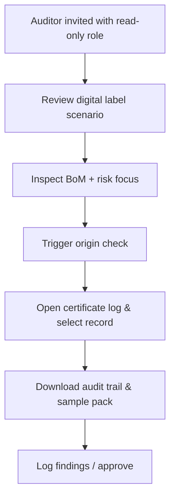

# Auditor Onboarding Audit

## Journey Notes
- Auditor persona needs evidence packs linking HS codes to batch identifiers and highlighting disputed laminates; onboarding must enforce sampling flows.【F:data/persona-scenarios.ts†L367-L399】
- Certificates table exposes status, confidence, and timestamps but lacks sampling, signature, or notary verification indicators critical for audit readiness.【F:components/tables/DataTable.tsx†L45-L129】
- Origin calculator returns alternatives and applied rules but no explicit audit trail export references, so auditors may not know where to retrieve supporting docs.【F:app/api/origin/calculate/route.ts†L20-L191】

## Blockers & Risks
1. **Sampling controls:** No UI to mark certificates for sampling or attach inspector notes; onboarding cannot demonstrate regulatory sampling coverage.【F:components/tables/DataTable.tsx†L79-L129】
2. **Signature verification:** Persona expects signature checks, yet certificate result payload does not include e-signature metadata.【F:data/persona-scenarios.ts†L383-L399】【F:app/api/origin/calculate/route.ts†L193-L233】
3. **Audit trail navigation:** Explainability and audit logs require manual navigation; onboarding should link to audit-trail view automatically after calculation.【F:components/dashboard/OriginCalculator.tsx†L316-L430】

## Acceptance Criteria
- Auditor onboarding includes sampling queue, signature status, and document checklist before approving certificates.
- Audit trail export references are surfaced in result screen with deep link to supporting assets.
- Read-only role can flag issues without editing calculations but can trigger follow-up tasks.
