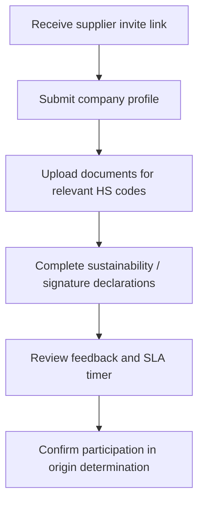

# External Supplier Onboarding Audit

## Journey Notes
- Supplier personas (procurement director, quality engineer) emphasise recycled content, sustainability affidavits, and documentation uploads; onboarding lacks a dedicated supplier portal reflecting those needs.【F:data/persona-scenarios.ts†L217-L364】
- Current UI assumes internal operator manages BoM; there is no external upload component or success metric for supplier completion rate.【F:components/dashboard/OriginCalculator.tsx†L199-L314】
- Health dashboard indicates notifications and cache states but no SLA timers for supplier response tracking during onboarding.【F:components/dashboard/SystemStatus.tsx†L77-L118】

## Blockers & Risks
1. **Missing supplier workspace:** Without external authentication and upload surfaces, suppliers rely on email or manual operator entry, delaying onboarding completion.【F:components/dashboard/OriginCalculator.tsx†L199-L270】
2. **Sustainability attachments:** Persona insights note persistence of ESG attachments, but onboarding does not show where suppliers provide them or verify retention.【F:data/persona-scenarios.ts†L143-L177】
3. **SLA visibility:** No dashboards or timers to show supplier response time or upload status, reducing accountability.【F:components/dashboard/SystemStatus.tsx†L77-L118】

## Acceptance Criteria
- Supplier invite leads to dedicated portal with progress indicator, required documents list, and SLA countdown.
- ESG attachments and declarations persist across calculations and are visible to operators and suppliers.
- Supplier completion KPI recorded and surfaced in dashboards for compliance review.
