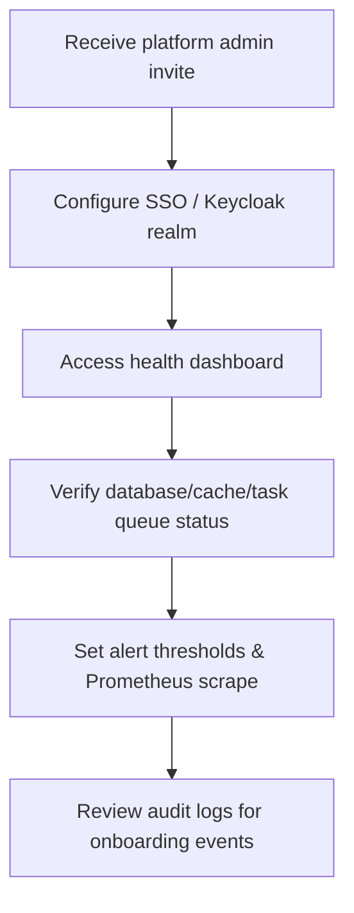

# System Administrator Onboarding Audit

## Journey Notes
- SystemStatus component polls `/api/health` every 30 seconds and surfaces database, cache, queue, and notification status, matching admin onboarding needs but lacking SLA targets or trends.【F:components/dashboard/SystemStatus.tsx†L1-L118】
- Health payload differentiates enabled vs connected states yet does not expose uptime history or thresholds; onboarding cannot confirm SLO adherence.【F:components/dashboard/SystemStatus.tsx†L77-L118】
- Metrics and dashboard stats require multiple API calls without rate limiting or auth guard details, raising questions about admin controls.【F:components/dashboard/DashboardStats.tsx†L24-L83】

## Blockers & Risks
1. **Alerting gap:** No integration with alertmanager or Slack despite existing health metadata, so admins must poll manually during onboarding.【F:components/dashboard/SystemStatus.tsx†L77-L118】
2. **AuthZ coverage:** Health endpoint is open in frontend; onboarding flow should verify role-based access to prevent supplier personas hitting admin telemetry.【F:components/dashboard/SystemStatus.tsx†L17-L70】
3. **Observability setup:** No instructions for scraping metrics endpoints or verifying `/api/metrics`, delaying readiness checklist completion.【F:app/api/metrics/route.ts†L1-L120】

## Acceptance Criteria
- Admin onboarding exposes SLA thresholds, breach badges, and links to alert destination configuration.
- `/api/health` gated via admin role claims and documented in onboarding checklist.
- Observability quickstart includes Prometheus scrape config and sample alert rules validated during onboarding.
